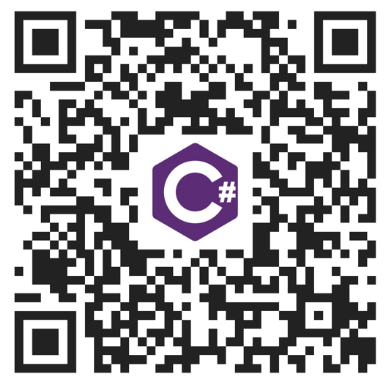
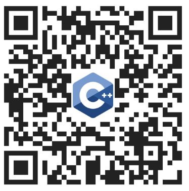
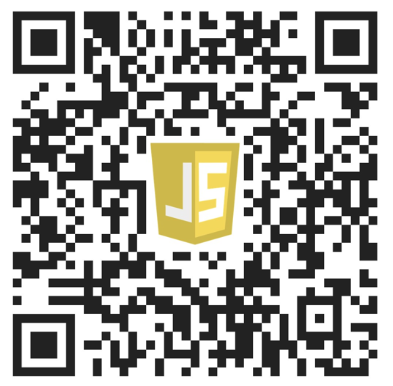

# Other Hands-on Labs 🧩

In addition to our featured HTML Image Gallery and Star Wars API labs, the GitHub Copilot workshop includes several other hands-on labs that demonstrate the capabilities of GitHub Copilot across different programming languages and scenarios.

## Available Labs 📋

| Name | Language | Description | Length |
| ---- | -------- | ----------- | ------ |
| **Javascript Calculator** | HTML/Javascript | A small app that serves as a good starter project | 20 mins |
| **Rock Paper Scissor** | Python | A slightly more advanced app | 45 mins |
| **Restaurant API + Deployment** | Python/Azure | Creating and deploying a simple API to Azure | 45 mins |
| **C Sharp Web App** | C# | Working with .NET Web Technologies and unit tests | 1 hour |
| **Timer and Selector** | HTML, CSS, React | Building components for workshop trainers | 30 mins |
| **Interest Calculator** | C++ | Building an interest calculator with unit tests | 30 mins |
| **API Testing with SWAPI** | C# | Implementing tests for an API | 30 mins |

## External Lab Resources 🔗

These labs are hosted in separate repositories. Click on the links below to access them:

### Javascript Calculator ➗
**Duration**: 20 minutes  
**Description**: A small app provided by GitHub that serves as a good starter project for beginners.  
**Link**: [Instructions](https://github.com/ps-copilot-sandbox/javascript-calculator-demo)

### Rock Paper Scissors ✂️
**Duration**: 45 minutes  
**Description**: A slightly more advanced app provided by GitHub that demonstrates more complex interactions.  
**Link**: [Instructions](https://github.com/copilot-workshops/copilot-rock-paper-scissors?tab=readme-ov-file)

### Restaurant API + Deployment 🍽️
**Duration**: 45 minutes  
**Description**: Create a simple API and deploy it to Azure Container Apps.  
**Link**: [Instructions](https://github.com/devndive/coding-with-gh-copilot/blob/main/README.md)

### C Sharp Web App 🌐
**Duration**: 1 hour  
**Description**: GitHub Copilot repository for the Business Hackathon with .NET Web Technologies (C# ASP.NET / Blazor and Unittests).  
**Link**: [Instructions](https://github.com/Blubern/GCH-CSharpAspUnitTest)  
**QR Code**: 

### Timer and Selector ⏱️
**Duration**: 30 minutes  
**Description**: Build a website for trainers that includes components like a timer for breaks and a selector for choosing participants.  
**Link**: [Instructions](https://github.com/Blubern/GCH-WebDevJavaScript)  
**QR Code**: 

### Interest Calculator 💰
**Duration**: 30 minutes  
**Description**: Build an interest calculator together with a unit test in C++.  
**Link**: [Instructions](https://github.com/Blubern/GCH-CPlusPlus)  
**QR Code**: 

### API Testing with SWAPI 🧪
**Duration**: 30 minutes  
**Description**: Implement tests to test the Star Wars API.  
**Link**: [Instructions](https://github.com/tobiaswittenburg/SWAPITest)  
**QR Code**: 

## How to Choose a Lab 🤔

When selecting a lab for your workshop, consider:

1. **Audience Experience Level**: Choose labs that match the programming experience of your participants
2. **Available Time**: Select labs that fit within your workshop timeframe
3. **Programming Language Preference**: Pick labs that use languages familiar to your audience
4. **Learning Objectives**: Select labs that demonstrate the specific GitHub Copilot features you want to highlight

## Tips for Running Labs Successfully 💡

1. **Pre-workshop Setup**: Ensure all participants have GitHub Copilot access before the workshop
2. **Environment Check**: Verify that participants have the necessary development environments set up
3. **Pair Programming**: Consider having participants work in pairs for more collaborative learning
4. **Time Management**: Set clear timeboxes for each section of the lab
5. **Checkpoints**: Establish checkpoints throughout the lab to ensure everyone is progressing
6. **Assistance**: Have additional facilitators available to help participants who get stuck
7. **Wrap-up Discussion**: After each lab, discuss what was learned and how GitHub Copilot helped

Happy coding with GitHub Copilot! 🚀
